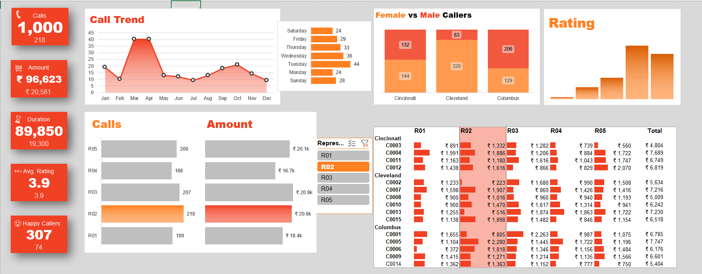

# 📊 Excel Dashboard Project

## Overview
This project is an interactive dashboard built using **Microsoft Excel** to analyze and visualize data effectively. It transforms raw data into meaningful insights through dynamic reports, charts, and KPI indicators.

The dashboard was created as part of my learning journey in **Data Analytics**, where I explored how Excel can be used not just for spreadsheets but also for professional business intelligence and reporting.

---

## Objective
The main objective of this project is to:

- Clean and organize raw data
- Perform data analysis using Excel
- Generate meaningful business insights
- Build an interactive dashboard for decision-making

---

## Features
✔ Interactive Dashboard  
✔ Pivot Tables & Pivot Charts  
✔ Dynamic KPI Cards  
✔ Data Cleaning & Transformation  
✔ Slicers for Filtering  
✔ Lookup Functions (XLOOKUP / VLOOKUP)  
✔ Conditional Formatting  
✔ Trend Analysis & Visualization  

---

## Tools & Functions Used
### Microsoft Excel
- Pivot Tables  
- Pivot Charts  
- Slicers  
- Conditional Formatting  
- Data Validation  
- Named Ranges  

### Excel Functions
- `XLOOKUP()`
- `IFS()`
- `SUMIFS()`
- `COUNTIFS()`
- `IF()`
- `TEXT()`

---

## Workflow
### 1. Data Collection
Collected raw dataset containing relevant records for analysis.

### 2. Data Cleaning
Performed:
- Missing value handling
- Duplicate removal
- Formatting corrections
- Column standardization

### 3. Data Analysis
Created multiple Pivot Tables to summarize data and identify patterns.

### 4. Dashboard Development
Designed visual dashboard using:
- Charts
- KPI cards
- Filters
- Dynamic visuals

---

## Key Insights
The dashboard helps identify:
- Overall performance trends
- High-performing categories
- Patterns in data distribution
- Important KPIs for business monitoring

---

## Dashboard Preview




---

## Project Structure

```bash
Excel-Dashboard-Project/
│
├── Dashboard Project.xlsx
├── Sample data.xlsx
├── README.md
├── images_Dasboard_1.png
├── images_Dasboard_2.png
├── images_Dasboard_3.png
├── images_Dasboard_4.png
└── images_Dasboard_5.png
---

## Skills Demonstrated
- Data Analysis
- Data Cleaning
- Dashboard Design
- Business Reporting
- Analytical Thinking
- Excel Automation

---

## Learning Outcome
One month ago, I didn’t even know dashboards could be created in Excel.  
Today, I built a complete interactive dashboard from scratch.

This project reflects my progress in learning **Data Analytics**, and it strengthened my understanding of how raw data can be transformed into actionable insights.

---

## Future Improvements
- Power BI version of dashboard  
- Advanced analytics using Python  
- Predictive analysis using Machine Learning  

---

## Connect With Me
GitHub : https://github.com/vishnuthakur-05
LinkedIn:https://www.linkedin.com/in/vishnuvardhansingh/
